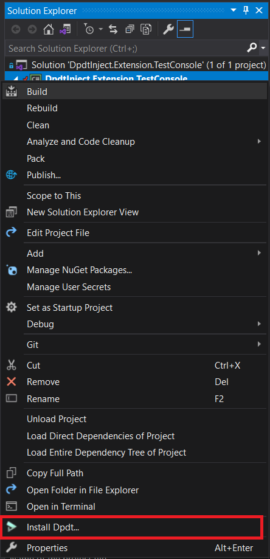
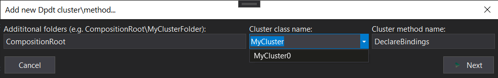
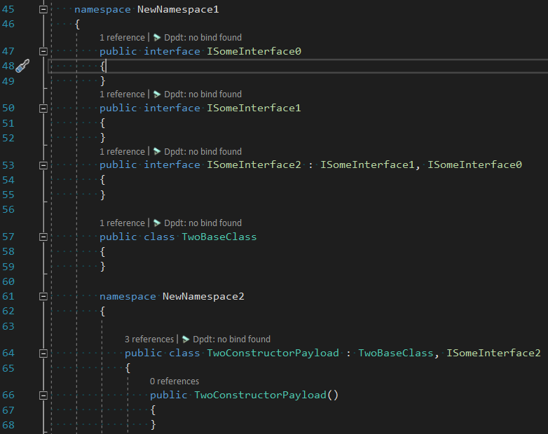
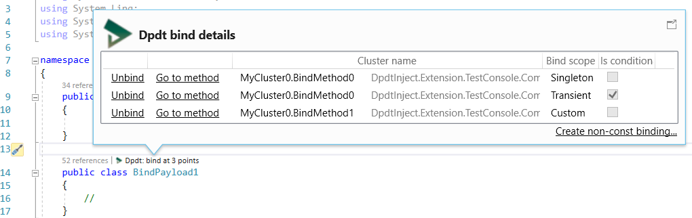
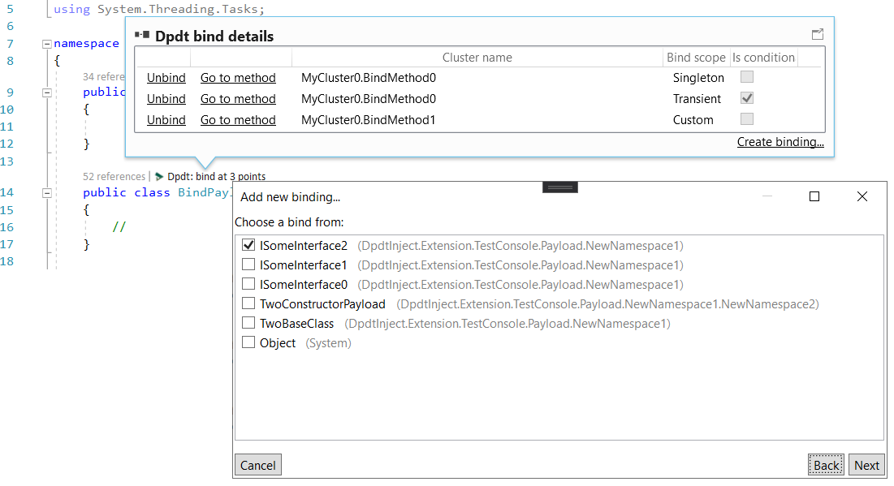
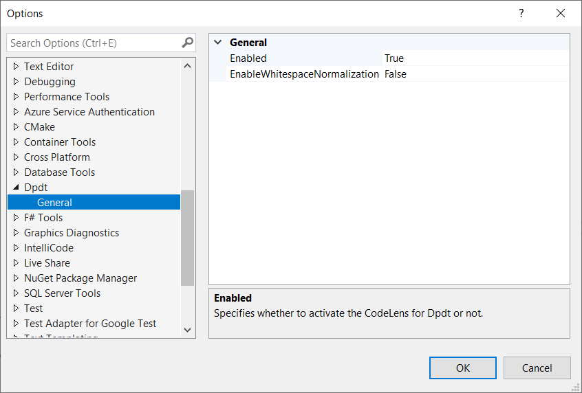

# DpdtInject


[](https://github.com/lsoft/DpdtInject/actions)
[](https://www.nuget.org/packages/Dpdt.Injector/)


# Purpose

Dpdt is a compile-time DI container based on C# Source Generators. Its goal is to remove everything possible from runtime and make resolving process as faster as we can. This is achieved by transferring huge piece of resolving logic to the compilation stage into the source generator.

# Status

It's only a proof-of-concept. Nor alpha, neither beta.

# Features

0. Easy-to-read syntax `Bind<IA>().To<A>().WithTransientScope()`.
0. Custom constructor arguments `... Configure(new ConstructorArgument("message", Message))`.
0. Generic `Get<T>` and non generic `Get(Type t)` resolutions.
0. Constrained `GetFast` fast resolutions.
0. Single object `Get` or collection `GetAll` resolutions.
0. `Func<T>` resolutions.
0. `ToIsolatedFactory` bindings with automatic factory code generation.
0. `ToProxy` binding with automatic generate an interceptor class.
0. Transient, singleton and constant scopes.
0. Custom scopes.
0. Child kernels (aka child clusters).
0. Bindings by conventions.
0. Additional compile-time safety.
0. Binding settings that modify compile-time code generation.
0. Same performance on the platforms with no compilation at runtime.
0. Dpdt Visual Studio Extension helps you to be more productive (see below).
0. At last, Dpdt produces a very, very fast resolution code.

More to come!

# Performance

0. Very impressive Fast resolutions.
0. Good Generic resolution performance.
0. Good enough, but not the best NonGeneric resolution - Microresolver is fantastically fast; what's the magic? :)

``` ini

BenchmarkDotNet=v0.12.0, OS=Windows 10.0.18363
AMD Ryzen 7 4700U with Radeon Graphics, 1 CPU, 8 logical and 8 physical cores
.NET Core SDK=5.0.100-rc.2.20479.15
  [Host]     : .NET Core 3.1.7 (CoreCLR 4.700.20.36602, CoreFX 4.700.20.37001), X64 RyuJIT
  Job-OKTIPR : .NET Core 3.1.7 (CoreCLR 4.700.20.36602, CoreFX 4.700.20.37001), X64 RyuJIT

Runtime=.NET Core 3.1  Server=True  

```

Here is the results of a resolution a complex tree of 500 objects total:


|                               Method |      Mean |     Error |    StdDev | Gen 0 | Gen 1 | Gen 2 | Allocated |
|------------------------------------- |----------:|----------:|----------:|------:|------:|------:|----------:|
|             Dpdt.GenericSingleton500 |  4.325 us | 0.0407 us | 0.0381 us |     - |     - |     - |         - |
|          Dpdt.NonGenericSingleton500 | 13.641 us | 0.1126 us | 0.1054 us |     - |     - |     - |         - |
|  Dpdt.FastSingleton500 (**fastest**) |  2.577 us | 0.0104 us | 0.0097 us |     - |     - |     - |         - |
|           DryIoc.GenericSingleton500 | 16.148 us | 0.1470 us | 0.1375 us |     - |     - |     - |         - |
|        DryIoc.NonGenericSingleton500 |  9.728 us | 0.1689 us | 0.1580 us |     - |     - |     - |         - |
|    Microresolver.GenericSingleton500 |  7.276 us | 0.0573 us | 0.0536 us |     - |     - |     - |         - |
| Microresolver.NonGenericSingleton500 |  3.784 us | 0.0158 us | 0.0148 us |     - |     - |     - |         - |


|                               Method |     Mean |    Error |   StdDev |  Gen 0 | Gen 1 | Gen 2 | Allocated |
|------------------------------------- |---------:|---------:|---------:|-------:|------:|------:|----------:|
|             Dpdt.GenericTransient500 | 40.32 us | 0.330 us | 0.309 us | 4.1504 |     - |     - |  77.02 KB |
|          Dpdt.NonGenericTransient500 | 63.08 us | 0.489 us | 0.433 us | 4.1504 |     - |     - |  77.02 KB |
|  Dpdt.FastTransient500 (**fastest**) | 37.93 us | 0.253 us | 0.224 us | 3.8452 |     - |     - |   71.2 KB |
|           DryIoc.GenericTransient500 | 66.87 us | 1.288 us | 1.581 us | 4.2725 |     - |     - |  77.02 KB |
|        DryIoc.NonGenericTransient500 | 62.60 us | 0.480 us | 0.449 us | 4.1504 |     - |     - |  77.02 KB |
|    Microresolver.GenericTransient500 | 64.77 us | 0.294 us | 0.261 us | 4.2725 |     - |     - |  77.02 KB |
| Microresolver.NonGenericTransient500 | 68.52 us | 2.869 us | 8.415 us | 4.1504 |     - |     - |  77.02 KB |
	


Also I recommend disable tiered compilation for composition root assembly if you want to obtain full performance at the start.


# How to try

Please refer to Dpdt.Injector [nuget package](https://www.nuget.org/packages/Dpdt.Injector/). Keep in mind you need to set 'net5' target framework. For example:

```
<Project Sdk="Microsoft.NET.Sdk">

  <PropertyGroup>
    <OutputType>Exe</OutputType>
    <TargetFramework>net5</TargetFramework>

    <!-- disable tiered compilation for composition root assembly -->
    <TieredCompilation>false</TieredCompilation>
    <TieredCompilationQuickJit>false</TieredCompilationQuickJit>
    <TieredCompilationQuickJitForLoops>false</TieredCompilationQuickJitForLoops>

    <EmitCompilerGeneratedFiles>true</EmitCompilerGeneratedFiles>
  </PropertyGroup>

  <ItemGroup>
    <PackageReference Include="Dpdt.Injector" Version="0.4.2.1-alpha" />
  </ItemGroup>

</Project>
```


# Design

## To be fair: design drawbacks at first place

0. Because of design, it's impossible to `Unbind` and `Rebind`.
0. Because of source generators, it's impossible to direclty debug your bind code, including its `When` predicates.
0. Because of massive rewriting the body of the cluster, it's impossible to use a local variables (local methods and other local stuff) in `ConstructorArgument` and `When` predicates. To make bind works use instance based fields, properties and methods instead. To make bind debuggable, use fields, properties and methods of the other, helper class.
0. No deferred bindings by design with exception of cluster hierarchy.
0. Slower source-to-IL compilation, slower JIT compilation.

## Syntax

Dpdt syntax was partially inspired by Ninject.

### Regular singleton/transient/custom binding

```csharp
Bind<IB1, IB2>()
    .To<BClass>()
    .WithSingletonScope() //WithTransientScope, WithCustomScope
    ;
```

### Regular const binding

Only readonly fields, static readonly fields and in-place compile-time constants are allowed to be a target constant:


```csharp
private /*static*/ readonly string _roString = "readonly string";

...

Bind<string>()
    .WithConstScope(_roString)
    ;
```

### Conditional bindings

```csharp
Bind<IA>()
    .WithConstScope(ConstantA)
    .When(rt => rt.ParentTarget?.TargetType == typeof(B2))
    ;
```

### Predefined constructor arguments with additional setting

```csharp
Bind<IB>()
     .To<B>()
     .WithSingletonScope()
     .Setup<AllowedCrossCluster>()
     .Configure(new ConstructorArgument("argument1", field_or_property_or_expression1))
     .Configure(new ConstructorArgument("argument2", field_or_property_or_expression2))
     ;
```

### Proxy (and decorator at the same time) bindings

```csharp

//your custom telemetry event saver
//saver is invoked from multiple threads even in parallel
//so saver must be thread-safe
Bind<SessionSaver>()
    .To<SessionSaver>()
    .WithSingletonScope()
    ;

//example of the payload, that will be injected into the proxy:
Bind<ICalculator>()
    .To<Calculator>()
    .WithSingletonScope() //may be singleton or transient
    .When(rt => rt.WhenInjectedExactlyInto<ProxyCalculator>())
    ;


//proxy binding example
//proxy invokes its saver for every invocation of the proxied methods, EVEN in parallel!
Bind<ICalculator>()
    .ToProxy<ProxyCalculator>()
    .WithProxySettings<TelemetryAttribute, SessionSaver>() //additional details about these classes are available at the tests project
    .WithSingletonScope() //proxy should be in the same scope as its payload
    .Setup<SuppressCircularCheck>() //this suppress unused warning
    .When(rt => rt.WhenInjectedExactlyNotInto<ProxyCalculator>()) //this suppress stack overflow during resolution
    ;

//"proto" class of the proxy:
public partial class ProxyCalculator : ICalculator { }

```

### Conventional bindings

Conventional bindings are "machine-gun" binding producing machine, that scans your assemblies and produces a lot of binding statements. If you are know Ninject.Conventions you know what I wanted to implement. Conventional bindings works with Roslyn symbols and are produced at compile-time.

```csharp
ScanInAssembliesWith<A0>() //scan assembly(ies) that contains a specified type(s)
    .SelectAllWith<IA>() //select all classes that implements a specific class/interface
    .ExcludeAllWith<IExclude>() //but not to include all classes that implements this class/interface
    .From<IA, IB>() //binds from these interfaces/classes (they may be different with the classes/interfaces in SelectAllWith); others options are exists too
    .ToItself() //to the processed class
    .WithSingletonScope() //and now we continue with regular binding syntax, including With*Scope/Setup/Configure/When and etc.
    ;
```

Dpdt does not support conventional bindings to proxy or factory, because of design.


A lot of examples of allowed syntaxes are available in the test project. Please refer that code.

Binding expressions are contained in methods marked with attribute `[DpdtBindingMethod]`. No argument allowed for that methods, and in fact they are not executed at all. Class with `[DpdtBindingMethod]`-methods should be derived from `DpdtInject.Injector.DefaultCluster`. This class should be `partial`. Many binding methods per cluster (even in different compilation units) allowed to exist. You can use this to split your bindings into different groups (something like Ninject's modules).

## Choosing constructor

Constructor is chosen at the compilation stage based on 2 principles:

0. Constructors are filtered by `ConstructorArgument` filter. If no `ConstructorArgument` has defined, all existing constructors will be taken.
0. The constructor with the minimum number of parameters is selected to make a binding.

Need to have a more complex constructor choosing algorithm? Let me know.

## Scope

Bind clause with no defined scope raises a question: an author forgot set a scope or wanted a default scope? We make a decision not to have a default scope and force a user to define a scope.

### Singleton

The only one instance of defined type is created. If instance is `IDisposable` then `Dispose` method will be invoked at the moment the cluster is disposing. This operation is thread safety, double checking locking algorithm is on.

### Transient

Each resolution call results with new instance. `Dispose` for targets will not be invoked.

### Constant

Constant scope is a scope when the cluster receive an outside-created object. Its `Dispose` will not be invoked, because the cluster is not a parent of the constant object.

### Custom

```csharp
    Bind<IA>()
	.To<A>()
	.WithCustomScope()
	;

...

    using(var scope1 = cluster.CreateCustomScope())
    {
	var a1 = cluster.Get<IA>(scope1);

	using(var scope2 = cluster.CreateCustomScope())
	{
	    var a2 = cluster.Get<IA>(scope2);
	} //here we dispose a2 if IA is IDisposable
    } //here we dispose a1 if IA is IDisposable
```

`IDisposable` custom-binded objects will be disposed at the moment of the scope object dispose. Keep in mind, custom-scoped bindings are resolved much slower than singleton/transient/constant bindings.

## Conditional binding

Each bind clause may have an additional filter e.g.

```csharp
    Bind<IA>()
	.To<A>()
	.WithSingletonScope()
	.When(IResolutionTarget rt =>
	{
	     condition to resolve
	})
	;
```

Please refer unit tests to see the examples. Please note, than any filter makes a resolution process slower (a much slower! 10x slower in compare of unconditional binding!), so use this feature responsibly. Resolution slowdown with conditional bindings has an effect even on those bindings that do not have conditions, but they directly or indirectly takes conditional binding as its dependency. Therefore, it is advisable to place conditions as close to the resolution root as possible.

Also, these predicates cannot be debugged because they are rewrited by Dpdt. See below how to overcome it.

## Fast resolutions

Dpdt contains a special resolution type named 'fast'. Its syntax is `cluster.GetFast(default(IMyInterface));`. In general this syntax is faster that generic resolutions, but it has one additional constraint: you need to resolve directly from cluster type, it is impossible to cast cluster to the one of its interface (like `ICluster` or `IResolution`) and do fast resolutions.

## Compile-time safety

Each safety checks are processed in the scope of concrete cluster. Dpdt cannot check for cross-cluster issues because clusters tree is built at runtime. But cross-cluster checks are performed in the cluster constructor at runtime.

### Did source generators are finished their job?

Dpdt adds a warning to compilation log with the information about how many clusters being processed and time taken. It's an useful bit of information for debugging purposes.

### Unknown constructor argument

Dpdt will break ongoing compilation if binding has useless `ConstructorArgument` clause (no constructor with this parameter exists).

### Singleton takes transient or custom

Dpdt can detect cases of singleton binding takes a transient/custom binding as its dependency, and make signals to the programmer. It's not always a bug, but warning might be useful.

### Circular dependencies

Dpdt is available to determine circular dependencies in your dependency tree. In that cases it raise a compilation error. One additional point: if that circle contains a conditional binding, Dpdt can't determine if circular dependency will exists at runtime, so Dpdt raises a compile-time warning instead of error. This behaviour can be changed by appropriate setting.

### More than 1 unconditional child

If for some binding more than 1 unconditional child exists it renders parent unresolvable, so Dpdt will break the compilation is that case.

## Cluster life cycle

The life cycle of the cluster begins by creating it with `new`. The cluster can take other cluster as its parent, so each unknown dependency will be resolved from the parent (if parent exists, otherwise exception would be thrown).

The end of the life cycle of a cluster occurs after the call to its `Dispose` method. At this point, all of its disposable singleton bindings are also being disposed. It is prohibited to dispose of the cluster and use it for resolving in parallel . It is forbidden to resolve after a `Dispose`.

## Child clusters

```csharp
    public partial class RootCluster : DefaultCluster
    {
        public RootCluster(your arguments) : this((ICluster)null!) { ... }
    }

    public partial class ChildCluster : DefaultCluster
    {
        public ChildCluster(ICluster cluster, your arguments) : this(cluster) { ... }
    }

...

    var rootCluster = new RootCluster(
        your arguments
        );
    var childCluster = new ChildCluster(
        rootCluster,
        your arguments
        );
```

Clusters are organized into a tree. This tree cannot have a circular dependency, since it is based on constructor argument. Dependencies, consumed by the binding in the child cluster, are resolved from the home cluster if exists, if not - from **parent cluster**.

If some binging does not exist in local cluster, Dpdt will request it from parent cluster at runtime. This behavior can be modified by settings `OnlyLocalCluster`/`AllowedCrossCluster`/`MustBeCrossCluster`.


## Async resolutions

Dpdt is a constructor-based injector. Async resolutions are not supported because we have no an async constructors. Consider using a factory class with an async method `async Task<Something> CreateSomethingAsync(...)`.


## Settings

Settings are things that modify compile-time cluster code generation. THEY ARE NOT WORKING AT RUNTIME.

### Cross cluster resolutions

These settings relates with checking for child binding resolutions; they are useful for an additional safety. They are applied for each of child resolutions.

#### OnlyLocalCluster

Each dependency **must** exists in local cluster. If not - ongoing compilation will break. Note: binding conditions is out of scope, only existing matters. You can define a local binding with `When(rt => false)`, and this check will mute. So, this setting is not something that can protect you at 100%. This is a default behaiour.

#### AllowedCrossCluster

Any dependency may be in home cluster or parent cluster. If local dependecy found at runtime it is used, otherwise request to the parent cluster is performed. (this is default behaviour for old version of Dpdt)

#### MustBeCrossCluster

NO local dependency allowed, any dependency MUST be in the parent cluster. If local dependency found, ongoing compilation will break. Note: binding conditions is out of scope, only existing matters. You can define a local binding with `When(rt => false)`, and this check will fire. So, this setting is not something that can protect you at 100%.


### Wrapper producing

These settings relate with a producing of wrapped-resolutions, like `Func<>`; they are  useful for minimizing the cluster size.

#### NoWrappers

No bindings for wrappers will be produced. It is a default value.

#### ProduceWrappers

**Every** type of wrappers will be produced for this binding.


### Circular checking

These settings relates with a circular checking; they are useful for removing unused noise from build log (for example in case of decorator, look at `ProxySimple0_Fixture` unit test).

#### PerformCircularCheck

Do circular checking. It is a default value.

#### SuppressCircularCheck

Do not circular checking. Use this for decorators bindings.


## Debugging your clusters and conditional clauses

Because of source generators are generating new code based on your code, it's impossible to direclty debug your cluster code, including its `When` predicates (because this code is not actually executed at runtime). It's a disadvantage of Dpdt design. For conditional clauses, you need to call another class to obtain an ability to catch a breakpoint:

```csharp
    public partial class MyCluster : DefaultCluster
    {
        [DpdtBindingMethod]
        public void BindMethod()
        {
            Bind<IA, IA2>()
                .To<A>()
                .WithSingletonScope()
                .When(rt =>
                {
                    //here debugger is NOT working

                    return Debugger.Debug(rt);
                })
                ;
        }
    }

    public static class Debugger
    {
        public static bool Debug(IResolutionTarget rt)
        {
            //here debugger is working
            return true;
        }
    }
```

## Artifact folder

As a regular source generator, Dpdt is able to store pregenerated C# code at the disk. The only thing you need is correctly setup your csproj. For example:

```
    <EmitCompilerGeneratedFiles>true</EmitCompilerGeneratedFiles>
    <!-- next line allows you to define a custom directory to store Dpdt's artifacts, for example: -->
    <!-- <CompilerGeneratedFilesOutputPath>$(ProjectDir)Dpdt.Pregenerated</CompilerGeneratedFilesOutputPath> -->
```

If your clusters are huge, you may face with slowdowns in your work in VS because VS runs Dpdt in the background. To overcome this please put the following into your csproj:

```
  <PropertyGroup>
    <Dpdt_Generator_Beautify>false</Dpdt_Generator_Beautify>
  </PropertyGroup>

  <ItemGroup>
    <CompilerVisibleProperty Include="Dpdt_Generator_Beautify" />
  </ItemGroup>

```
This is to turn off code beautification so Dpdt will produce cluster code a bit faster.

# Dpdt Visual Studio Extension

To make a dealing with Dpdt easier, a [Visual Studio Extension](https://marketplace.visualstudio.com/items?itemName=lsoft.DpdtVisualStudioExtension) has been developed. Make note: it only supports Visual Studio 2019 16.8, because I can't test it against older version of Visual Studio.

If you click on a project in Solution Explorer and there is no Dpdt nuget installed, you can install its latest version easily:



Also, you can create a new cluster/binding method:



But the main function is to generate a binding clauses through the custom codelens. The following images makes the picture brighter:







Settings window:



A lot of thanks to bert2 and his amazing example `https://github.com/bert2/microscope`, without his `microscope` no Dpdt extension will appear because of lack of tutorials in the scope of VS extension development.

Any ideas for new features are welcome.

# Known problems

* Dpdt extension do not support few types (in different assemblies) with the same full name. I will investigate it further.

If any problem occurs with this extension or the generator itself, please let me know. I will need to see the following log files `C:\Users\<user>\AppData\Local\Temp\dpdt_*.log`.

# Feedback

Feel free to send a feedback by creating an issues here. Cheers!
